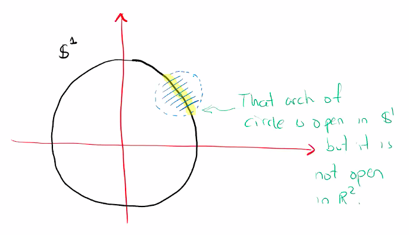

# The Subspace Topology

$$
\newcommand{\ds}{\displaystyle}
\newcommand{\curlies}[1]{\lbrace #1 \rbrace}

\newcommand{\T}{\mathcal T}
\newcommand{\Ext}{\text{Ext}}
\newcommand{\B}{\mathcal B}
$$

## Subspace Topology

Let $(X, \T)$ be a topological space, and $A \subseteq X$ be a subset. We define the **subspace topology** on $A$ as

$$
\T_A = \curlies{ U \cap A : U \in \T}
$$

**Proof that $\T_A$ is a topology**

1. $\emptyset$ and $A$

   - $\emptyset \in \T_A$ since $\emptyset \in \T$
   - $X \in \T$, so $X \cap A = A \in \T_A$

2. Arbitrary unions

   - suppose \( \curlies{U_i}_{i \in I} \subseteq \T \), then $\ds \bigcup_{i \in I} U_i \in \T$

   - for each $i \in I$, $U_i \cap A \in \T_A$

   - $\ds \bigcup_{i \in I} (U_i \cap A) = \left( \bigcup_{i \in I} U_i \right) \cap A \in \T_A$

3. Finite intersections
   - suppose $U_1, ..., U_n \subseteq \T$, then $\ds \bigcap_{i=1}^n U_i \in \T$
   - $\ds \bigcap_{i=1}^n (U_i \cap A) = \left( \bigcap_{i=1}^n U_i \right) \cap A \in \T_A$

We say $A$ is a **subspace** of $X$ to mean $A \subseteq X$ with the subspace topology.

- if $B \subseteq A$ is open (or closed) in $(A, \T_A)$, we say $B$ is open (or closed) relative to $A$
  - we need to be precise, because $\T_A \not \subseteq \T$
  - thus if $B$ is open relative to $A$, that does not necessarily mean that $B$ is open relative to $X$

### Example - $S^1 \subseteq \R^2$

### When are open sets in a subspace open in the original set?

If $A \subseteq X$ is open in $X$, then $\T_A$ consists of all open sets of $X$ inside of $A$, so $\T_A \subseteq \T$.

- to prove this, consider that intersections of open sets are open, and $\T_A$ is defined by intersecting $A$ with open sets

Similarly, if $C \subseteq X$ is closed then the closed subsets of $(C, \T_C)$ are the closed sets of $\T$ which are subsets of $C$.

## Definition by pullback

Let $A \subseteq X$, then it comes naturally with an injection $\iota_A : A \to X$, $\iota_A: x \to x$, called the **inclusion map**.

We can define a set of subsets by "pullback":
$$
\curlies{\iota_A^{-1}(U) : U \in \T}
$$
However, notice that for each $U \subseteq X$, $\iota_A^{-1}(U) = U \cap A$, so this pullback is equal to $\T_A$!

The result below shows how this sort of definition allows us to define a subspace topology by deciding which functions are continuous.

### Continuity of $\iota_A$

$\iota_A: A \to X$ is continuous, and $\T_A$ is the smallest topology where this is true.

**Proof.**

Let $U \in \T$ be open, then $\iota_A^{-1}(U) = U \cap A \in \T_A$, so $\iota_A$ is continuous.

Any topology that makes $\iota_A$ continuous requires by definition that every inverse image of an open set in $\T$ is open, so $\T_A = \curlies{ \iota_A^{-1}(U) : U \in \T}$ must be a subset of any topology on $A$ where $\iota_A$ is continuous.
