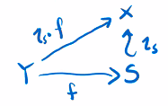
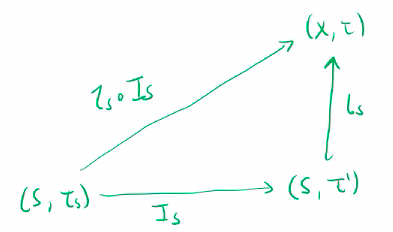
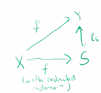
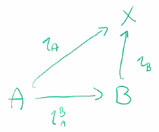

# The Subspace Topology

$$
\newcommand{\ds}{\displaystyle}
\newcommand{\curlies}[1]{\left\lbrace #1 \right\rbrace}

\newcommand{\T}{\mathcal T}
\newcommand{\Ext}{\text{Ext}}
\newcommand{\B}{\mathcal B}
$$

## Subspace Topology

Let $(X, \T)$ be a topological space, and $A \subseteq X$ be a subset. We define the **subspace topology** on $A$ as

$$
\T_A = \curlies{ U \cap A : U \in \T}
$$

**Proof that $\T_A$ is a topology**

1. $\emptyset$ and $A$

   - $\emptyset \in \T_A$ since $\emptyset \in \T$
   - $X \in \T$, so $X \cap A = A \in \T_A$

2. Arbitrary unions

   - suppose $ \curlies{U_i}_{i \in I} \subseteq \T $, then $\ds \bigcup_{i \in I} U_i \in \T$

   - for each $i \in I$, $U_i \cap A \in \T_A$

   - $\ds \bigcup_{i \in I} (U_i \cap A) = \left( \bigcup_{i \in I} U_i \right) \cap A \in \T_A$

3. Finite intersections
   - suppose $U_1, ..., U_n \subseteq \T$, then $\ds \bigcap_{i=1}^n U_i \in \T$
   - $\ds \bigcap_{i=1}^n (U_i \cap A) = \left( \bigcap_{i=1}^n U_i \right) \cap A \in \T_A$

We say $A$ is a **subspace** of $X$ to mean $A \subseteq X$ with the subspace topology.

- if $B \subseteq A$ is open (or closed) in $(A, \T_A)$, we say $B$ is open (or closed) relative to $A$
  - we need to be precise, because $\T_A \not \subseteq \T$
  - thus if $B$ is open relative to $A$, that does not necessarily mean that $B$ is open relative to $X$

### Example - $S^1 \subseteq \R^2$

### When are open sets in a subspace open in the original set?

If $A \subseteq X$ is open in $X$, then $\T_A$ consists of all open sets of $X$ inside of $A$, so $\T_A \subseteq \T$.

- to prove this, consider that intersections of open sets are open, and $\T_A$ is defined by intersecting $A$ with open sets

Similarly, if $C \subseteq X$ is closed then the closed subsets of $(C, \T_C)$ are the closed sets of $\T$ which are subsets of $C$.

## Definition by pullback

$A \subseteq X$ comes naturally with an injection $\iota_A : A \to X$, $\iota_A: x \mapsto x$, called the **inclusion map**.

We can define a set of subsets by "pullback":

$$
\curlies{\iota_A^{-1}(U) : U \in \T}
$$

However, notice that for each $U \subseteq X$, $\iota_A^{-1}(U) = U \cap A$, so this pullback is equal to $\T_A$!

The result below shows how this sort of definition allows us to define a subspace topology by deciding which functions are continuous.

### Continuity of $\iota_A$ when $A$ is a subspace

$\iota_A: (A, \T_A) \to (X, \T)$ is continuous, and $\T_A$ is the smallest topology where this is true.

**Proof.**

Let $U \in \T$ be open, then $\iota_A^{-1}(U) = U \cap A \in \T_A$, so $\iota_A$ is continuous.

Any topology that makes $\iota_A$ continuous requires by definition that every inverse image of an open set in $\T$ is open, so $\T_A = \curlies{ \iota_A^{-1}(U) : U \in \T}$ must be a subset of any topology on $A$ where $\iota_A$ is continuous.

This means that $\iota_A$ is continuous iff the topology on $A$ contains $\T_A$.

## Characteristic property of subspace topology

Suppose $X$ is a topological space.

1. Suppose $S \subseteq X$ is a subspace. Then $(S, \T_S)$ satisfies $(P_S)$: a map $f: Y \to S$ is continuous if and only if the composite map $\iota_S \circ f : Y \to X$ is continuous.

2. If $S \subseteq X$ is any subset, then the only topology that on $S$ that satisfies $(P_S)$ is the subspace topology.

**Proof.**

1. Suppose $S$ is a subspace of $X$.

​    ($\Rightarrow$) Suppose $f: Y \to S$ is continuous, then $\iota_S \circ f : Y \to X$ is continuous, because it is the composition of continuous functions

​    ($\Leftarrow$) Suppose $\iota_S \circ f$ is continuous, then we need to prove that $f$ is continuous. Let $U \subseteq S$ be an open set in $S$, then we can find an open set $V \subseteq X$ with $U = V \cap S$. Then,

$$
\begin{align}
f^{-1}(U) &= f^{-1}(V \cap S) \\
&= f^{-1}(\iota_S^{-1}(V)) \\
&= (\iota_S \circ f)^{-1}(V)
\end{align}
$$

​    $\iota_S \circ f$ is continuous, so $(\iota_S \circ f)^{-1}(V) = f^{-1}(U)$ is open. Thus $f$ is continuous.

2. Suppose $S \subseteq X$ with a topology $\T'$ and $(P_S)$ holds.

​    We need to prove that $\T' = \T_S$, the subspace topology.

​    Let $I_S: (S, \T_S) \to (S, \T')$ be the identity map. $(S, \T')$ satisfies the characteristic property, so we can pick $Y = (S, \T_S)$ and $I_S = f:Y \to S$.

​    The function $\iota_S \circ I_S$ is the identity map from $(S, \T_S)$ to $(X, \T)$, so it is an identity from a subspace of $X$ to $X$, so it is continuous. By $(P_S)$, this means that $I_S$ is also continuous. Thus, if $U \subseteq S$ is open in $\T'$, then $I_S^{-1}(U) = U$ is also open in $\T_S$. This implies $\T' \subseteq \T_S$.

​    Doing the same thing with $I_S': (S, \T') \to (S, \T_S)$ we get $\T_S \subseteq \T''$, so $\T' = \T_S$.

### The identity map is a homeomorphism iff topologies are equal

Let $\T_1, \T_2$ be topologies on $X$. Then the identity map $id_X : (X, \T_1) \to (X, \T_2)$ is a homeomorphism if and only if $\T_1 = \T_2$.

$id_X$ is continuous iff for all open sets $U \in \T_2$, the preimage $id_X^{-1}(U) = U \in \T_1$, so it is continuous iff $\T_2 \subseteq \T_1$.

Similarly, $id_X^{-1}$ is continuous iff $\T_1 \subseteq \T_2$.

Thus, $id_X$ is a homeomorphism if and only if they are equal.

## Subspaces work nicely with continuity

Let $f: X \to Y$ be continuous.

1. If $S \subseteq X$ is a subspace, then $f\vert_S : S \to Y$ is continuous
2. If $S \subseteq Y$ is a subspace, then restricting the codomain $f_S : X \to S$ is continuous
3. If $Y \subseteq Z$ is a subspace, then $f_Z: X \to Z$ is continuous

**Proof.**

1. $f\vert_S = f \circ \iota_S$ which is a composition of continuous functions, so it is continuous
2. 
3. $f_Z = \iota_Y \circ f$ is a composition of continuous functions, so it is continuous

### Example: Isometries on $S^2$

Recall that $S^2 \subseteq \R^3$ is the unit sphere. Let $A \in \mathcal L(S^2)$ be a linear isometry, so $\langle Ax, Ay \rangle = \langle Ax, Ay \rangle$. Prove it is continuous when $S^2$ is a subspace of $\R^3$.

**Proof.**

A is a linear operator, so it is a continuous function on $\R^3$.

Then the restriction $A: S^2 \to \R^3$ is continuous.

Because $A$ is an isometry, $A(S^2) \subseteq S^2$. Then we can restrict the codomain and see that $A : S^2 \to S^2$ is continuous.

### Example: Invertible $2 \times 2$ matrices

Consider invertible matrices in $\R^4$

$$
\begin{pmatrix} a & b \\ c & d \end{pmatrix} \in \R^4,\ ad - bc \neq 0
$$

The space of these matrices given the subspace topology from $\R^4$ is called $GL(2, \R)$.

Then the matrix inverse map

$$
\begin{align}
i : &\ GL(2, \R) \to GL(2, \R) \\
&\ \begin{pmatrix} a & b \\ c & d \end{pmatrix} \mapsto \frac{1}{ad - bc} \begin{pmatrix} d & -b \\ -c & a \end{pmatrix}
\end{align}
$$

is continuous, as it is a continuous map from $GL(2, \R)$ to $\R^4$ with its range restricted to the subspace $GL(2, R)$.

## Nice properties of subspaces

Let $X$ be a topological space

1. If $A \subseteq B \subseteq X$, then $\T_A = (\T_B)_A$ - so the subspace topology of $A$ in $X$ is the same as the subspace topology of $A$ in the subspace $B$
2. Suppose $\B$ is a basis for $X$. The set $\B_A = \curlies{A \cap B: B \in \B}$
3. If $X$ is Hausdorff, second-countable, or first-countable, then so are its subspaces

**Proof.**

1. Suppose $A \subseteq B \subseteq X$.

We define the inclusion maps $\iota_A : A \to X$, $\iota_B : B \to X$, and $\iota_A^B: A \to B$.

Consider $B$ as a subspace of $X$, then it satisfies the characteristic property. Then, no matter what topology $A$ has, $\iota_A^B$ is continuous iff $\iota_A$ is continuous.

If we choose $A$ to have the topology $\T_A$, then $\iota_A$ is continuous, so $\iota_A^B$ is continuous, so $(\T_B)_A \subseteq A$.

If we choose $A$ to have the topology $(T_B)_A$, then $\iota_A^B$ is continuous, so $\iota_A$ is continuous, so $\T_A \subseteq (\T_B)_A$.