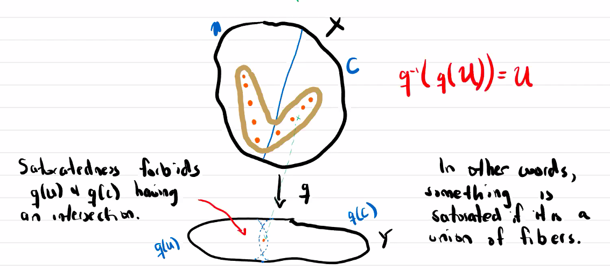
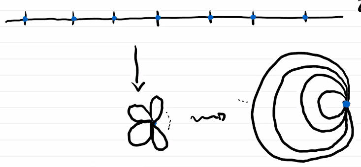
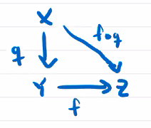
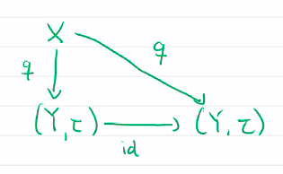
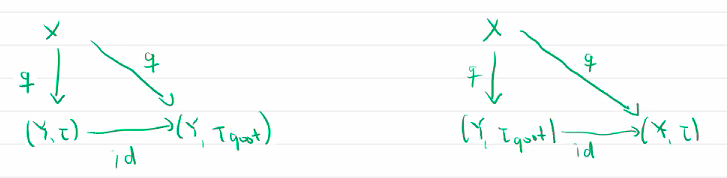
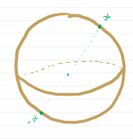
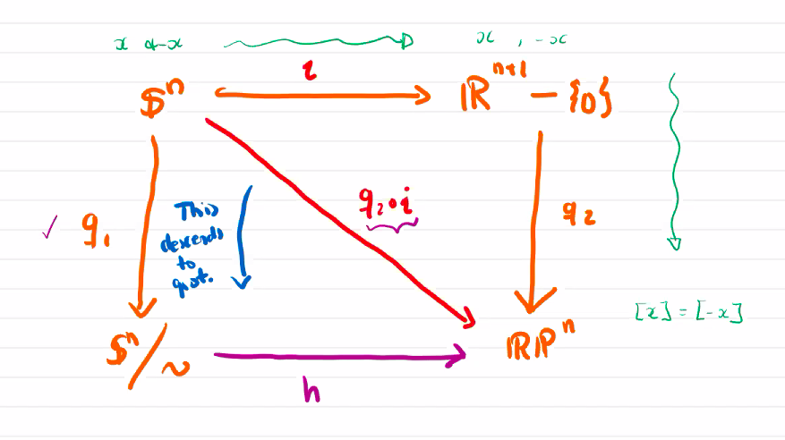

# The Quotient Topology

$$
\newcommand{\ds}{\displaystyle}
\newcommand{\curlies}[1]{\left\lbrace #1 \right\rbrace}

\newcommand{\T}{\mathcal T}
\newcommand{\Ext}{\text{Ext}}
\newcommand{\B}{\mathcal B}
$$

## The Quotient Topology

Let $q : X \to Y$ be a surjective map and $X$ be a topological space. We define the **quotient topology** on $Y$ by

$$
\T_{quot} = \curlies{ V \subseteq Y : q^{-1}(V) \subseteq X \text{ is open}}
$$

Equivalently, if $q: X \to Y$ is a surjective map between topological spaces, we say $q$ is a quotient map if

$$
V \subseteq Y \text{ is open} \Leftrightarrow q^{-1}(V) \subseteq X \text{ is open}
$$

#### The quotient topology is a topology

1. $\emptyset$ and $Y$
   - $q^{-1}(\emptyset) = \emptyset$ and $q^{-1}(Y) = X$, which are both open, so $\emptyset, Y$ are open
2. Arbitrary unions
   - $\ds q^{-1}\left(\bigcup_{\alpha} U_\alpha\right) = \bigcup_{\alpha} q^{-1}\left(U_\alpha\right)$ which is a union of open sets in $X$, so it is open
3. Finite intersections
   - $\ds q^{-1}\left(\bigcap_{i=1}^n U_i\right) = \bigcap_{i=1}^n q^{-1}\left(U_i\right)$ which is a finite intersection of open sets in $X$, so it is open

### Philosophy of quotient maps

1. We begin with a topological space $(X, \T)$ and we want to glue certain points together We can do this by giving an equivalence relation on $X$, which partitions $X$ into equivalence classes. The set of equivalence classes is denoted by $X/\sim$.
2. This provides us with a map $\pi : X \to X/\sim$, and $X/\sim$ has no topology but we can assign it the quotient topology. So equivalence classes are "close" if the points that map to them are "close."
3. $X/\sim$ thus becomes a topological space, but it is still abstract. We want to identify $X/\sim$ with another topological space that is more concrete. We can do this by studying the gluing on $X$ directly.

#### Example: The unit square and the torus

Consider $I = [0, 1] \times [0, 1] \subseteq \R^2$.

Define $\sim$ by:

- if $(x, y) = (u, v)$ then $(x, y) \sim (u, v)$
- for all $y$, $(0, y) \sim (1, y)$
- for all $x$, $(x, 0) \sim (x, 1)$

## Fibers

Let $f: X \to Y$ be a map.

A **fiber** of $f$ is a set $f^{-1}(y)$ for $y \in Y$.

A set $U \subseteq X$ is **saturated** if $f^{-1}(f(U)) = U$.

### Quotient maps and saturated sets

1. A continuous surjective map $q : X \to Y$ is a quotient map if and only if it sends saturated open sets (or saturated closed sets) to open sets (or closed sets)
2. Compositions of quotient maps are quotient maps
3. An injective quotient map is a homeomorphism
4. If $q : X \to Y$ is a quotient map, then $K \subseteq Y$ is closed if and only if $q^{-1}(K) \subseteq X$ is closed
5. If $q : X \to Y$ is a quotient map and $U \subseteq X$ is a saturated open set, then $q\vert_U : U \to q(U)$ is a quotient map.

**Proof.**

*Part 1.*

($\Rightarrow$) Suppose $q$ is a quotient map.

Suppose $U \subseteq X$ is a saturated open set. By definition of quotient spaces, $q(U)$ is open if and only if $q^{-1}(q(U))$ is open. Since $U$ is saturated, $q^{-1}(q(U)) = U$, so $q(U)$ is open.

Suppose $C \subseteq X$ is a saturated closed set. We want to prove that $q^{-1}\left(q(C)^C\right)$ is open

...

($\Leftarrow$) Suppose $q$ sends saturated open sets to open sets.

We need to prove $q: X \to Y$ is a quotient map, so $V \subseteq Y$ is open if and only if $q^{-1}(V) \subseteq X$ is open.

Since $q$ is continuous we already have one direction. For the other, suppose $q^{-1}(V) \subseteq X$ is open. $q^{-1}(V)$ is saturated since $q^{-1}(q(q^{-1}(V))) = q^{-1}(V)$. Since it is saturated and open, $q$ maps it to an open set $q(q^{-1}(V)) = V$, so $V$ is open. Thus, $V$ is open if and only if $q^{-1}(V)$ is open.

---

*Lemma.* A closed surjective continuous map or open surjective continuous map is a quotient map.

This follows immediately from 1.

#### Example: Quotient maps on the unit square

## Quotient maps and topological properties

> "The quotient topology can destroy almost everything." - Malors

Quotient maps do not necessarily preserve many properties!

E.g. consider the equivalence relation on $\R$:

- $x \sim y$ if $x = y$
- $x \sim y$ if $x, y \in \Z$

The real line is first and second countable, but the gluing is not!

## Characteristic property of quotients

Let $X$ be a topological space and $q: X \to Y$ a surjective map.

*Part 1:*

The quotient topology on $Y$ induced by $q$ satisfies $(P_Q)$: for all topological spaces $Z$ and maps $f: Y \to Z$, $f$ is continuous if and only if $f \circ q: X \to Z$ is continuous.

Remark: from the perspective of maps and sets, if we have $g : X \to Z$ and we want to use the characteristic property, then $g$ must respect the identifications made by $q$, i.e. if $q(x_1) = q(x_2)$ then $g(x_1) = g(x_2)$.

*Part 2:*

The quotient topology on $Y$ induced by $q$ is the only topology on $Y$ that satisfies $(P_Q)$.

**Proof**

*Part 1:*

Suppose $q : X \to Y$ is a quotient map.

($\Rightarrow$) If $f : Y \to Z$ is continuous then the composition $f \circ q$ is continuous

($\Leftarrow$) Suppose $f \circ q: X \to Z$ is continuous. Let $V \subseteq Z$ be open, then $(f \circ q)^{-1}(V) \subseteq X$ is open. Equivalently, $q^{-1}(f^{-1}(V))$ is open. However, $q^{-1}(U)$ is open if and only if $U$ is open, so $f^{-1}(V) \subseteq$ must be open. Thus $f$ is continuous.

*Part 2:*

Suppose $(Y, \T)$ satisfies $(P_Q)$. Then setting $Z = Y$,

Since the identity is continuous, by $(P_Q)$, $q$ is continuous.

The diagonal map $q$ is continuous in both of these diagrams, so by $(P_Q)$ the identity is a homeomorphism, so $\T = \T_{quot}$.

### Corollary: Uniqueness of quotient spaces

Let $X$ be a topological space and $q_1: X \to Y_1$ and $q_2 : X \to Y_2$ be quotient maps. If $q_1(x) = q_1(y) \Leftrightarrow q_2(x) = q_2(y)$, then $Y_1 \cong Y_2$.

#### Example: The projective plane

Let $X = R^{n+1}$, and define an equivalence relation $\overset{1}{\sim}$ on $R^{n+1} \setminus \curlies{0}$ by $x \overset{1}{\sim} y$ if $x = \lambda y$ for some $\lambda \in \R, \lambda \neq 0$. We define the projective plane as $\mathbb{RP}^n = (R^{n+1} \setminus \curlies{0}) / \overset{1}{\sim}$.

Now take $S^n \subseteq R^{n+1}$ and define $\overset{2}{\sim}$ on $S^n$ by $x \overset{2}{\sim} x$ and $x \overset{2}{\sim} -x$. We endow $S^n$ with the subspace topology, then we can also define the projective plane $\mathbb{RP}^n = S^n / \overset{2}{\sim}$.

We can make these equivalent constructions because $(R^{n+1} \setminus \curlies{0}) / \overset{1}{\sim}$ and $S^n / \overset{2}{\sim}$ make the same identifications, so they are homeomorphic.

