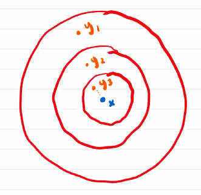
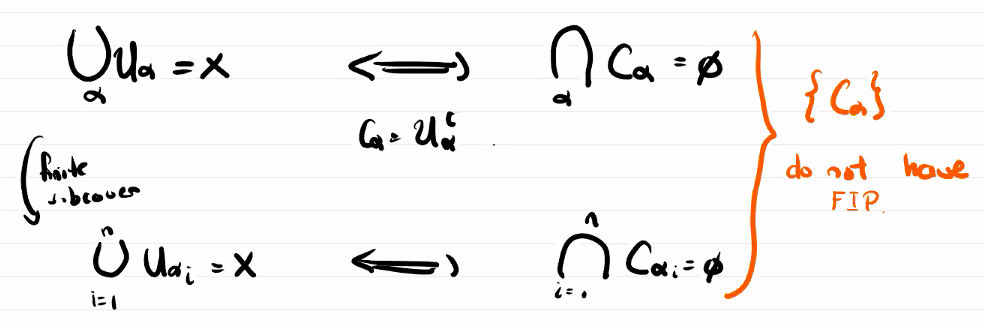
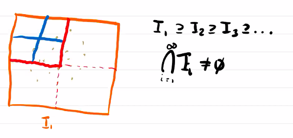
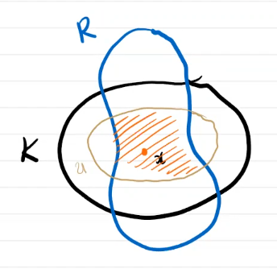

# Compactness

$$
\newcommand{\ds}{\displaystyle}
\newcommand{\curlies}[1]{\left\lbrace #1 \right\rbrace}

\newcommand{\T}{\mathcal T}
\newcommand{\Ext}{\text{Ext}}
\newcommand{\B}{\mathcal B}
$$

## Compactness

Let $X$ be a topological space. We say $X$ is **compact** if for every open cover $U = \curlies{U_\alpha}_{\alpha \in A}$ there is a finite subcover. That is there are $\alpha_1, ..., \alpha_n$ so that

$$
X = U_{\alpha_1} \cup ... \cup U_{\alpha_n}
$$

If $A \subseteq X$ is compact with the subspace topology we say it is a compact subspace.

Compactness is a way to generalize the properties of finite or "small" spaces.

### Example: $\R^n$ is not compact

Consider the cover

$$
U = \curlies{B_n(\mathbf 0)}_{n \in \N}
$$

Clearly $U$ is an open cover of $R^n$, but if we pick a finite subcover $B_{n_1}(\mathbf 0), ..., B_{n_k}(\mathbf 0)$, then its union is $B_{\max(n_1, ..., n_k)}(\mathbf 0)$ which is not equal to $\R^n$.

Generally, it is easier to show that things are not compact than to show that they are compact!

### Remark on proving compactness

To prove that $X$ is compact, it is not enough to find a finite cover of $X$. This is not equivalent to the definition!

However, it is also difficult to start with an arbitrary infinite cover and try to find a finite subcover.

What we want to do is to find equivalent properties.

### The Heine-Borel theorem

A subset of $\R^n$ is compact if and only if it is closed and bounded.

#### Example: $S^n$ is compact

If $f: \R^{n+1} \to \R$ is defined by $f(\mathbf x) = \lvert\mathbf x\rvert - 1$, then $f$ is continuous. The preimage of a closed set under a continuous function is closed, so $f^{-1}(\curlies{\mathbf 0}) = S^n$ is closed. Furthermore, $S^n$ is clearly bounded as every point in it has a norm of 1. Thus by the Heine-Borel theorem, $S^n$ is compact.

Note that this theorem only applies to $\R^n$! It does not make sense in a topological space that is not a metric space. Furthermore, it does not hold in metric spaces in general.

### Compact spaces and limit points

Let $X$ be a compact space and $A \subseteq X$ be an infinite subset. Then $A$ has a limit point in $X$.

**Proof.**

Suppose $A$ is an infinite subset without a limit point. Thus, every $x \in X$ has a neighbourhood $U_x$ which does not include any point from $A$ except possibly $x$ itself. Hence,

$$
\curlies{U_x}_{x \in X}
$$

is an open cover of $X$. By compactness, there is a finite subcover, so there are $x_1, ..., x_n$ so that $X = U_{x_1} \cup ... \cup U_{x_n}$. Since each $U_x$ contains at most one point of $A$, $A \setminus (U_{x_1} \cup ... \cup U_{x_n}) = A \setminus \curlies{x_1, ..., x_n}$. $A$ is infinite so removing a finite number of points should not make it empty, so there exists $y \in A \setminus (U_{x_1} \cup ... \cup U_{x_n})$. However, $A \setminus (U_{x_1} \cup ... \cup U_{x_n})$ should be equal to $A \setminus X = \emptyset$. Thus we have reached a contradiction, so there must be a limit point of $A$.

#### Example: $\ell^2(\R)$ is not compact

$$
\ell^2(\R) = \curlies{(c_1, c_2, ...) : \sum_{i=1}^\infty c_i^2 < \infty}
$$

This is a metric space with distance function:

$$
d((x_1, x_2, ...), (y_1, y_2, ...)) = \sqrt{\sum_{i=1}^\infty (x_i - y_i)^2}
$$

Inside $\ell^2(\R)$ there is a "sphere", aka the set of points $\vec{x}$ where $d(\vec{x}, 0) = 1$.

This is closed and bounded. Now notice that the sequences

$$
\begin{align}
&(1, 0, 0, ...) \\
&(0, 1, 0, ...) \\
&(0, 0, 1, ...) \\
\end{align}
$$

all have distance $\sqrt 2$ between them, so this "sphere" has no limit points.

Thus, this sphere cannot be compact!

## Limit point compactness

Let $X$ be a topolocial space. We say $X$ is **limit point compact** if every infinite subset of $X$ has a limit point.

The theorem above shows us that compactness implies limit point compactness.

### Limit point compactness and convergent sequences

Let $X$ be a Hausdorff, first countable, limit point compact set, then every sequence in $X$ has a convergent subsequence.

**Proof.**

Let $\vec{x} = (x_1, x_2, ...)$ be any sequence in $X$.

If any $p \in X$ shows up an infinite number of times in $\vec{x}$, then $p, p, ...$ is a subsequence which converges to $p$.

Otherwise, without loss of generality, suppose that no $p \in X$ shows up in $\vec{x}$ more than once. Let $A = \curlies{x_1, x_2, ...}$, then since $A$ is infinite it has a limit point, $x$.

$X$ is first countable, so we can build a sequence in $A$ $\vec{y} = y_1, y_2, ...$ which converges to $x$.

This is not a subsequence, as $y_1, y_2, ...$ might not be in the same order as in $\vec{x}$.

We can construct a subsequence $\vec{z}$ by picking $y_1$, then picking the next term in $\vec{y}$ that shows up after $y_1$ in $\vec{x}$, and continuing in this fashion.

Thus, $\vec{z}$ is a subsequence of $\vec{y}$ so it converges to $x$, and it is also a subsequence of $\vec{x}$.

## Sequential compactness

Let $X$ be a topological space. If every sequence in $X$ has a convergent subsequence, we say $X$ is **sequentially compact**.

We proved above that if a space is limit point compact, first countable, and Hausdorff then it is sequentially compact.

### Sequential compactness and second countability implies compactness

Let $X$ be a second countable sequentially compact topological space. Then $X$ is compact.

**Proof.**

We will prove this by contradiction.

Suppose $U = \curlies{U_\alpha}_{\alpha \in A}$ is an infinite cover which does not have any finite subcovers.

Since $X$ is second countable, we can find a countable subcover $U_1, U_2, ...$ of $U$. This subcover does not have any finite subcovers as well.

For every $n \in \N$, we have

$$
\curlies{U_i}_{i=1}^n
$$

is not a subcover, so $U_1 \cup ... \cup U_n \neq X$, so there exists $p_n \in X \setminus (U_1 \cup ... \cup U_n)$. Then we have found a sequence $\curlies{p_n}$, and since $X$ is sequentially compact it has a convergent subsequence $p_{n_1}, p_{n_2}, ...$ which converges to $p$.

Since $U_1, U_2, ...$ is a cover, $p \in U_m$ for some $m$.

By definition of a limit, there exists $N \in \N$ so that if $k > N$ then $p_{n_k} \in U_m$. However, if we choose big enough $k > N$ so that $n_k > m$, then by definition $p_{n_k} \in X \setminus (U_1 \cup ... \cup U_{n_k}) \subseteq (U_1 \cup ... \cup U_{m})$. However, $p_n \in U_m$ as well. Thus we have reached a contradiction.

## Doing things with closed sets

We can equivalently do things with closed sets if we consider intersections rather than unions.

### Finite intersection property.

Let $X$ be a set and $A = \curlies{A_\alpha}_{\alpha \in I}$ a collection of subsets of $X$. We say $A$ has the **finite intersection property** if every finite subcollection of $A$ has nonempty intersection.

### Compactness and the finite intersection property

$X$ is compact if and only if every collection of closed sets with the finite intersection property has a nonempty intersection.

#### Example: Bolzano-Weierstrass theorem

A bounded infinite set in $\R^n$ has a limit point.

## Generalizations of compactness

Compactness is a very strong property, so we want to relax our notion of it.

There are several generalizations of compactness, including

- local compactness
- paracompactness

### Local compactness

Let $X$ be a topological space, then $X$ is **locally compact** if for every point $p \in X$, there is a compact set $K \subseteq X$ and an open neighbourhood $U$ of $p$ with $U \subseteq K$.

#### Precompactness

A set $A \subseteq X$ is **precompact** if $\overline A$ is compact. If $A$ is open then we call it a precompact open set.

This notion is important in functional analysis, where it is used to define compact operators.

#### Local compactness and Hausdorff spaces

Let $X$ be a Hausdorff space, then the following are equivalent:

1. $X$ is locally compact
2. Each point of $X$ has a precompact neighbourhood
3. $X$ has a basis of precompact open sets

**Proof.**

It is clear that $(3) \Rightarrow (2)$.

Suppose $(2)$. Let $x \in X$ be any point. Then there exists a precompact neighbourhood $U$ of $x$, so $\overline U$ is compact. Each $x$ has a compact set $\overline U$ and a neighbourhood $U \subseteq \overline U$, so $X$ is locally compact. Thus $(2) \Rightarrow (1)$.

Suppose $(1)$. Let $x \in X$ be any point. By $(1)$, there is a compact set $K$ and a neighbourhood $U$ so that $x \in U \subseteq K$. Since $X$ is Hausdorff and $K$ is compact, $K$ is closed. We can define

$$
V_x = \curlies{V \subseteq K : x \in V \text{ and } V \text{ is open}}
$$

Then it is clear that $U \in V_x$.

If $S \in V_x$ then $\overline S \subseteq K$. $\overline S$ is a closed subset of a compact space, so it is compact. Thus, $V_x$ is a set of precompact open sets.

Given any open set $R \subseteq X$ with $x \in R$, we know $U \cap R \subseteq K$ is open. Hence $U \cap R \in V_x$.

Thus $V_x$ is almost a basis, but it is contained within $K$. To find a basis for $X$, we define
$$
V = \bigcup_{x \in X} V_x
$$

Then $V$ satisfies the properties of a basis as each $V_x$ does, and it contains only precompact open sets. Thus, $(1) \Rightarrow (3)$.

