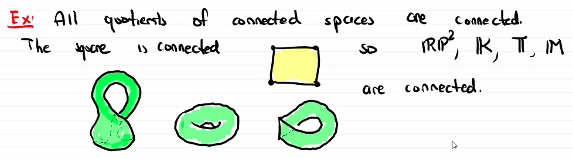
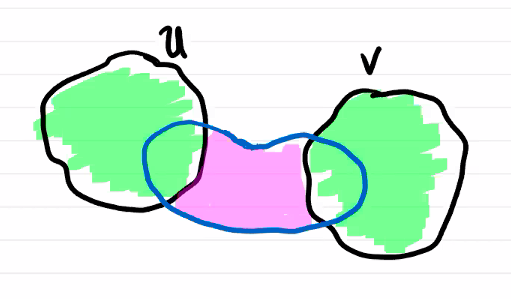
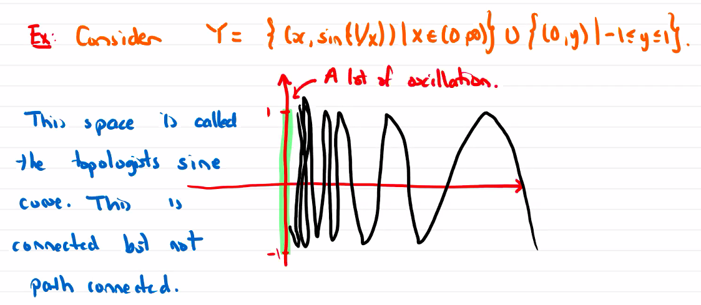

# Connectedness

$$
\newcommand{\ds}{\displaystyle}
\newcommand{\curlies}[1]{\left\lbrace #1 \right\rbrace}

\newcommand{\T}{\mathcal T}
\newcommand{\Ext}{\text{Ext}}
\newcommand{\B}{\mathcal B}
$$

## Connectedness

Let $X$ be a topological space. We say $X$ is **disconnected** if there exist two nonempty disjoint open sets $U, V \subseteq X$ so that $X = U \cup V$.

If $X$ is not disconnected, then it is **connected**.

### Clopen subsets

$X$ is connected if and only if the only nonempty subset of $X$ that is both open and closed is $X$ itself.

**Proof.**

($\Rightarrow$) Suppose $X$ is connected. $X$ is a topological space so it is both open and closed.

($\Leftarrow$) Suppose $X$ is disconnected, then there are nonempty open disjoint subsets $U, V$ so that $U \cup V = X$.

Since $U^C = V$, $V^C = U$, and $U, V$ are open, $U, V$ are also closed.

### Images of connected spaces are connected

Let $X$ be a connected space and $f : X \to Y$ be a continuous map. Then $f(X) \subseteq Y$ is connected.

For example, if $Y = \R$ and $p, q \in X$ with $f(p) = a$ and $f(q) = b$. Then $f$ takes on all values $c \in (a, b)$ (this is the Intermediate Value Theorem).

As another example, every quotient of a connected space is connected.

### Properties of connected spaces

1. Suppose $X$ is a topological space and $U, V$ are disjoint open subsets of $X$. If $A$ is a connected subspace of $X$ contained in $U \cup V$ then $A \subseteq U$ or $A \subseteq V$.
2. If $X$ contains a dense connected subspace then $X$ is connected.
3. Suppose $X$ is a topological space and $A \subseteq X$ is connected. Then $\overline A$ is connected, and so is any subspace $B$ with $A \subseteq B \subseteq \overline A$.
4. Let $X$ be a topological space and $\curlies{B_\alpha}_{\alpha \in A}$ a collection of connected subspaces of $X$ with a point in common. Then $\ds \bigcup_{\alpha \in A} B_\alpha$ is connected.

**Proof.**

(1)

$A \cap U$ and $A \cap V$ are open in $A$.

$A = (A \cap U) \cup (A \cap U^C)$. Since $U$ and $V$ are disjoint and $A \subseteq U \cup V$, $A \cap U^C = A \cap V$.

Thus $A \cap U$ and $A \cap V$ are both open subsets of $A$ and are complements of each other, so they are clopen. SInce $A$ is connected, one of them must be empty, so either $A \cap U = A$ so $A \subseteq U$, or $A \cap V = A$ so $A \subseteq V$.

(4)

Let $\ds p \in \bigcap_{\alpha \in A} B_\alpha$

Suppose $U, V$ are disjoint open sets that disconnect $B = \ds \bigcup_{\alpha \in A} B_\alpha$. This means the sets

$$
U \cap B\text{ and } V \cap B
$$

are nonempty and disjoint, and their union is $B$, and

$$
U \cap V \cap B = \emptyset
$$

since $U$ and $V$ are disjoint.

Then each $B_\alpha \subseteq U$ or $B_\alpha \subseteq V$. However, $p \in B_\alpha$ for every $\alpha$, so $p \in U$ and $p \in V$. This contradicts $U$ and $V$ disconnecting $B$, so $B$ must be connected.

## Path-connectedness

Let $X$ be a topological space. A **path** (or **curve**) in $X$ is a continuous map $\alpha : [0, 1] \to X$.

(Since any interval $[a, b] \subseteq \R$ is homeomorphic to $[0, 1]$, an equivalent definition of a curve is a continuous map $\alpha : [a, b] \to X$.)

We say $\alpha$ is a path between $p \in X$ and $q \in X$ if $\alpha(0) = p$ and $\alpha(1) = q$.

A topological space $X$ is **path connected** if there exists a path between any two points in $X$.

### Path-connected spaces are connected

Let $X$ be a path connected space and suppose $U, V$ are open subsets that disconnect $X$.

Let $u \in U$ and $v \in V$, then let $\alpha$ be a path connecting $u$ and $v$.

$\alpha([0, 1]) \subseteq U \cup V = X$, and it is connected (because it is the image of $[0, 1]$ which is connected). By property (1) proved above, this means that either $\alpha([0, 1]) \subseteq U$ or $\alpha([0, 1]) \subseteq V$, which is a contradiction.

Thus $X$ is connected.

For example, $\R^n$ is connected, as given points $\mathbf x$ and $\mathbf y$ we can construct the path $\alpha(t) = t\mathbf x + (1 - t) \mathbf y$ where $t \in [0, 1]$.

$S^n$ is also connected as given points $\mathbf x$ and $\mathbf y$ we can construct the path $\alpha(t) = cos(t)\mathbf x + sin(t) \mathbf y$ where $t \in [0, 2\pi]$.

### Connected does not imply path connected

## Components

### Path-connected components

Let $X$ be a topological space and let $x, y \in X$.

We say $x \underset{p}{\sim} y$ if there is a path connecting $x$ and $y$.

The equivalence classes defined by this relation are called **path-connected components**.

### Connected components

Let $X$ be a topological space and let $x, y \in X$.

We say $x \underset{c}{\sim} y$ if these exists a connected set $U \subseteq X$ with $x, y \in U$.

The equivalence classes defined by this relation are called **connected components**.

### Example: Orthogonal matrices

We define the space of **orthogonal matrices**
$$
O(n) = \curlies{A \in GL_n(\R) : A A^T = A^T A = I}
$$
This space is disconnected and compact.

**Disconnected:**

We know that the image of a connected space under a continuous function must be continuous. Consider the determinant $det : O(n) \to \R$. This function is continuous, and its image $det(O(n)) = \curlies{-1, 1}$: suppose $A \in O(n)$, then

$$
\begin{align*}
A A^T &= I \\
det(A A^T) &= 1 \\
det(A) det(A^T) &= 1 \\
det(A)^2 &= 1 \\
det(A) &= \pm 1
\end{align*}
$$
$\curlies{-1, 1}$ is disconnected, so $O(n)$ must also be disconnected.

Note that the determinant is constant on two disjoint subsets of $O(n)$, so there are at least two connected components.

In fact, there are two components. Let $SO(n)$ be the set of matrices in $O(n)$ with determinant $1$. Note that $I \in SO(n)$.

Suppose $A \in SO(n)$, then since $A$ does not change orientation, it can be written as a composition of rotations in different planes, i.e.
$$
A =
\begin{bmatrix}
\cos(\theta_1) & -\sin(\theta_1) \\
\sin(\theta_1) & \cos(\theta_1) \\
 & & \cos(\theta_2) & -\sin(\theta_2) \\
 & & \sin(\theta_2) & \cos(\theta_2) \\
 & & & & \ddots \\
 & & & & & 1
\end{bmatrix}
$$
(the $1$ at the end is not necessarily there if $n$ is even)

Then we can construct a path in $SO(n)$ from $I$ to $A$ as
$$
\phi(t) =
\begin{bmatrix}
\cos(\theta_1 t) & -\sin(\theta_1 t) \\
\sin(\theta_1 t) & \cos(\theta_1 t) \\
 & & \cos(\theta_2 t) & -\sin(\theta_2 t) \\
 & & \sin(\theta_2 t) & \cos(\theta_2 t) \\
 & & & & \ddots \\
 & & & & & 1
\end{bmatrix} \text{ where } t \in [0, 1]
$$
Thus, $SO(n)$ is path-connected.

$O(n) \setminus SO(n) = \curlies{-A : A \in SO(n)}$ is homeomorphic to $SO(n)$, so it is also path-connected.

$SO(n)$ and $O(n) \setminus SO(n)$ are disjoint, each is path connected, and their union is $O(n)$. Thus they are the two connected components of $O(n)$.

**Compact:**

$O(n) = det^{-1}(\curlies{-1, 1})$, so $O(n)$ is the preimage of a closed set under a continuous function, so it is closed.

Since each matrix in $SO(n)$ can be put in the form above, we can see that the norm of each matrix is $n$, since the norm of each column of the matrix is $1$ (because $\sin^2(x) = \cos^2(x) = 1$). The same is true for the rest of $O(n)$, since if $A \in O(n) \setminus SO(n)$ then $-A \in SO(n)$. Thus, $O(n)$ is bounded.

Since $SO(n)$ is a closed and bounded subspace of $\R^{n^2}$, by the Heine-Borel theorem it is compact.