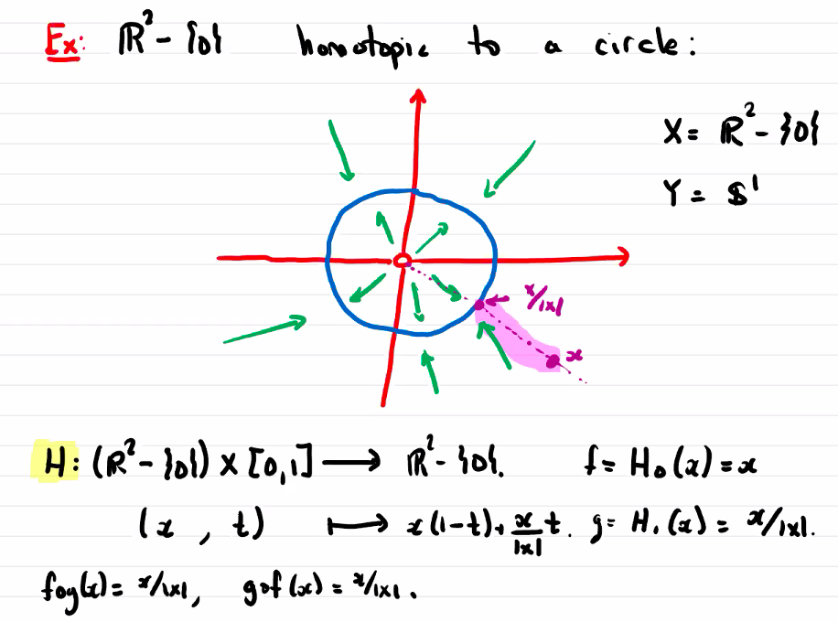

# Homotopy

$$
\newcommand{\ds}{\displaystyle}
\newcommand{\curlies}[1]{\left\lbrace #1 \right\rbrace}

\newcommand{\T}{\mathcal T}
\newcommand{\Ext}{\text{Ext}}
\newcommand{\B}{\mathcal B}
\newcommand{\Sp}{\mathbb S}
$$

## Discerning topological spaces

The main problem in algebraic topology is figuring out when topological spaces are not homeomorphic, aka distinguishing between spaces

- this is often done by coming up with and computing topological invariants so that different spaces have different values of the invariants

### Topological invariants

A **topological invariant** is a property that does not change under homeomorphism, so if $ti$ is a topological invariant and ,$X, Y$ are homeomorphic spaces, then $ti(X) = ti(Y)$

- compactness is a topological invariant, so we know that $\R^m$ and $\Sp^n$ are never homeomorphic
- connectedness is a topological invariant, and $\R$ is disconnected if we remove a single point but $\R^2$ is not, so $\R$ and $\R^2$ are not homeomorphic

## Homotopy

Let $X$, $Y$ be topological spaces, and $f, g: X \to Y$ be continuous maps. $f$ is **homotopic** to $g$ if there exists a continuous map $H: X \times [0, 1] \to Y$ so that

$$
H(x, 0) = f(x) \text{ and } H(x, 1) = g(x)
$$

If $f, g$ are homotopic maps we write $f \sim g$

### Homotopy is an equivalence relation on the set of maps

1. Given $f$, then we can define the homotopy $H(x, t) = f(x)$ between $f$ and $f$, so $f \sim f$
2. Suppose $f$ is homotopic to $g$, then there exists a homotopy $H : X \times [0, 1] \to Y$ from $f$ to $g$. Then $H'(x, t) = H(x, 1 - t)$ is a homotopy from $g$ to $f$. Thus, if $f \sim g$ then $g \sim f$
3. Suppose $f \sim g$ and $g \sim h$, then there are homotopies $H_1$ from $f$ to $g$ and $H_2$ from $g$ to $h$. Then we can create another homotopy by gluing $H_1(x, 1)$ and $H_2(x, 0)$ together:

$$
H'(x, t) = \begin{cases}
H_1(x, 2t) & 0 \leq t \leq \frac{1}{2} \\
H_2(x, 2t - 1) & \frac{1}{2} \leq t \leq 1
\end{cases}
$$

This is continuous by the gluing lemma

The set of equivalence classes of homotopic functions $X \to Y$, **homotopy classes**, is denoted $[X, Y]$

### Homotopy is preserved under composition

If $f_1, f_2 : X \to Y$ are homotopic and $g_1, g_2 : Y \to Z$ are homotopic, then $g_1 \circ f_1$ and $g_2 \circ f_2$ are homotopic

### Homotopy relative to a subspace

Let $X, Y$ be topological spaces and $A \subseteq X$ be a subspace. Let $f, g : X \to Y$ be continuous with $f\vert_A = g\vert_A$

$f$ and $g$ are **homotopic relative to $A$** if $f ~ g$ and the homotopy $H$ satisfies 

$$
H(x, t) = f(x) = g(x) \text{ for } x \in A,\ t \in [0, 1]
$$

## Paths and loops

### Path composition

Given paths $\alpha$ from $p$ to $q$  $\beta$ from $q$ to $r$, we can **compose** $\alpha$ and $\beta$:

$$
\gamma(x) = \begin{cases}
\alpha(2x) & 0 \leq x \leq \frac{1}{2} \\
\beta(2x - 1) & \frac{1}{2} \leq x \leq 1
\end{cases}
$$

so that $\gamma$ is a path from $p$ to $r$

We write $y = \alpha \cdot \beta$

### Inverse paths

Every path $\alpha : [0, 1] \to X$ has an inverse $\overline \alpha$ defined by $\overline \alpha(x) = \alpha(1 - x)$

### Loops

A particularly important type of path is a loop, a path from $p$ to $p$

The **constant loop** is the loop $c_p(x) = p$

### Path-homotopies

The main example of homotopy relative to a subspace is path-homotopy

Consider two points $p, q \in X$ and paths $\alpha, \beta: [0, 1] \to X$ both from $p$ to $q$

Then we can consider **path-homotopy**, aka homotopy of these paths relative to $\curlies{0, 1}$, aka homotopy $H$ so that

$$
\begin{align*}
&H(0, t) = p &\quad &H(1, t) = q \\
&H(x, 0) = \alpha(x) &\quad &H(x, 1) = \beta(x)
\end{align*}
$$

We write the path-homotopy class of a path $\alpha$ as $[\alpha]$

#### Properties of path-homotopies

1. Let $\alpha_1, \alpha_2$ be path-homotopic paths from $p$ to $q$ and $\beta_1, \beta_2$ be path homotopic paths from $q$ to $r$, then $\alpha_1 \cdot \beta_1 \sim \alpha_2 \cdot \beta_2$.
2. Let $\alpha$ be a path from $p$ to $q$, then $c_p \cdot \alpha \sim \alpha \sim \alpha \cdot c_q$
3. Let $a$ be a path from $p$ to $q$, then $\alpha \cdot \overline \alpha \sim c_p$ and $\overline \alpha \cdot \alpha \sim c_q$
4. If $\alpha_1, \beta, \gamma$ are paths from $p$ to $q$ to $r$ to $s$, then their composition is associative, so $(\alpha_1 \cdot \beta) \cdot \gamma \sim \alpha_1 \cdot (\beta \cdot \gamma)$

### The Fundamental Group

Let $X$ be a path-connected space and $p \in X$ be any point. We define the **fundamental group of $X$ based at $p$** as the set of path-homotopy classes on loops. It is denoted by $\pi_1(X, p)$.

It is denoted $\pi_1$ because iti s the "first" homotopy group. There are homotopy groups for each $n \in \N$, however we are only concerned with $\pi_1$.

The operation on $\pi_1(X, p)$ is composition of homotopy classes, $[\alpha] \cdot [\beta] := [\alpha \cdot \beta]$. The properties of path-homotopies above can be applied to show that this operation satisfies the group axioms:

1. Identity: $[\alpha] \cdot [c_p] = [c_p] \cdot [\alpha] = [\alpha]$
2. Inverse: $[\alpha] \cdot [\overline \alpha] = [\overline \alpha] \cdot [\alpha] = [c_p]$
3. Associativity: $([\alpha] \cdot [\beta]) \cdot [\gamma] = [\alpha] \cdot ([\beta] \cdot [\gamma])$

#### Simply connected spaces

We say $X$ is simply connected if its fundamental group is trivial, so $\pi_1(X, x) = [c_x]$, which is isomorphic to $\curlies{1}$.

## Homotopy-equivalent spaces

Homeomorphic spaces have isomorphic fundamental groups, so the fundamental group is a topological invariant. However, this is strong - spaces do not *need* to be homeomorphic to have the same fundamental group. We now define a new equivalence relation on spaces which also preserves fundamental groups.

Let $X, Y$ be topological spaces. $X$ and $Y$ are **homotopy equivalent** (and $X$ is **homotopic** to $Y$) if there exist continuous maps $f: X \to Y$ and $g: Y \to X$ so that $g \circ f \sim id_X$ and $f \circ g \sim id_Y$.

### Homeomorphic spaces are homotopic

Suppose $X \cong Y$ and let $h : X \to Y$ be a homeomorphism.

Then $h^{-1} \circ h = id_X \sim id_X$ and $h \circ h^{-1} = id_Y \sim id_Y$ (since every map is homotopic to itself). Thus, $X$ and $H$ are homotopic.

### Homotopy equivalence preserves fundamental group

Here we will investigate a correspondence between topological spaces and groups.

Let $f: X \to Y$ be a continuous map.

Given a loop $\alpha: [0, 1] \to X$, in $X$, we can find a loop in $Y$, $f \circ \alpha: [0, 1] \to Y$.

Let $\alpha'$ be a loop that is homotopic to $\alpha$, then $f \circ \alpha'$ is homotopic to $f \circ \alpha$.

Thus, $f$ "acts the same way" on loops in each path-homotopy class, so it induces a map $f_\ast: \pi_1(X, x) \to \pi_1(Y, f(x))$ between the fundamental groups of $X$ and $Y$ (based at $x$ and its image). We can show that $f_\ast([\alpha] \cdot [\beta]) = f_\ast([\alpha]) \cdot f_\ast([\beta])$, therefore $f_\ast$ is a group homomorphism.

Thus, we have established a correspondence between continuous functions and group homomorphisms.