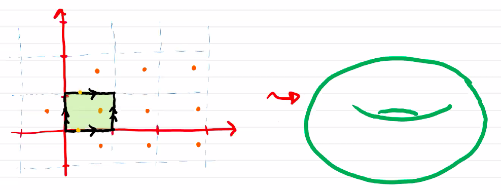
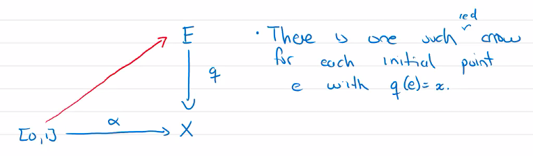
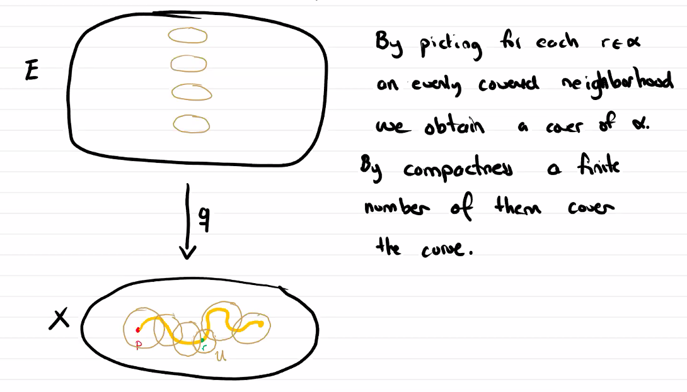
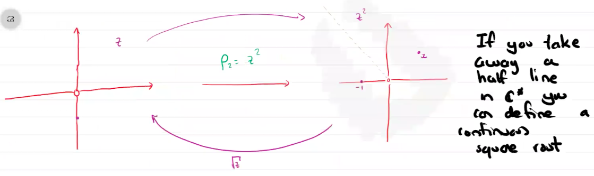

# Covering Spaces

$$
\newcommand{\ds}{\displaystyle}
\newcommand{\curlies}[1]{\left\lbrace #1 \right\rbrace}

\newcommand{\T}{\mathcal T}
\newcommand{\Ext}{\text{Ext}}
\newcommand{\B}{\mathcal B}
\newcommand{\C}{\mathbb C}
$$

## The lifting problem

Consider the complex plane $\C$ with the following equivalence relation:

$$
z \sim w \text{ if } z - w = a + bi, \text{ where } a, b \in \Z
$$

The resulting space is homeomorphic to the torus

...

## Covering spaces

Let $E, X$ be topological spaces where $X$ is path-connected and $q: E \to X$ be a surjective continuous map between them. $q$ is a **covering map** and $E$ is a **covering space of $X$** if for every point $x \in X$, there is an open neighbourhood $V$ of $x$ and a countable number of disjoint open sets $U_1, U_2, U_3, ... \subseteq E$ so that for each $U_i$, $q\vert_{U_i} : U_i \to V$ is a homemorphism.

(Note that $\curlies{U}_i$ being countable is not always required.)

[COPY THIS LATER, DON'T COMMIT]

[IF YOU SEE THIS ON THE WEBSITE THEN RIKIN IS A FOOL]

### Example: $S^n$ and $\mathbb{RP}^2$

Consider $S^n$ with antipodal points identified, i.e. with the equivalence relation $x \sim -x$, this is $\mathbb{RP}^2$. Then the quotient map $q: S \to \mathbb{RP}^2$ based on this equivalence relation is also a covering map.

### Lifting curves

Let $q: E \to X$ be a covering map, $x \in X$ any point, and $\alpha: [0, 1] \to X$, $\alpha(0) = X$ be any curve. Let $e \in E$ be a  point so that $q(e) = x$. Then there exists a *unique* curve $\tilde\alpha: [0, 1] \to E$ so that $q \circ \tilde \alpha = \alpha$ and $\tilde \alpha(0) = e$.

#### Example: Root functions on $\mathbb C$

Consider $\C^* = \C \setminus \curlies 0$, and define

$$
\begin{align}
\rho_n:\ &\C^* \to \C^* \\
&z \mapsto z^n
\end{align}
$$

​	This map is not a bijection, but we can choose a "branch" of its inverse.

### Fibres have the same cardinality

Let $q: E \to X$ be a covering map. Then for all $x \in X$, the cardinality of $q^{-1}(\curlies{x})$ is the same.

**Proof.**

Let $x \in X$ and define
$$
V = \curlies{y \in X : \lvert q^{-1}(\curlies y) \rvert = \lvert q^{-1}(\curlies x) \rvert}
$$
Let $U \subseteq X$ be an evenly covered neighbourhood of $x$. In each connected component of $q^{-1}(U)$, there is a single point in $q^{-1}(\curlies x)$. Suppose $z \in U$, then $q^{-1}(\curlies z) \subseteq q^{-1}(U)$, so it also appears once in each component of $q^{-1}(U)$, so its cardinality is the same as that of $q^{-1}(\curlies x)$. Thus, $U \subseteq V$.

Since $X$ is connected and $V$ is both open and closed, $V = X$.