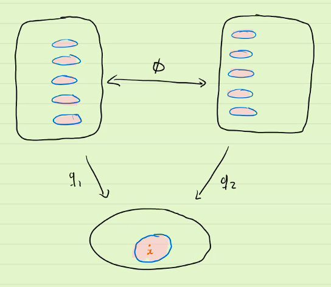

# Covering Spaces

$$
\newcommand{\ds}{\displaystyle}
\newcommand{\curlies}[1]{\left\lbrace #1 \right\rbrace}

\newcommand{\T}{\mathcal T}
\newcommand{\Ext}{\text{Ext}}
\newcommand{\B}{\mathcal B}
\newcommand{\C}{\mathbb C}
\newcommand{\Sp}{\mathbb S}
$$

## The lifting problem

Consider the complex plane $\C$ with the following equivalence relation:

$$
z \sim w \text{ if } z - w = a + bi, \text{ where } a, b \in \Z
$$

The resulting space is homeomorphic to the torus

...

## Covering spaces

Let $E, X$ be topological spaces where $X$ is path-connected and $q: E \to X$ be a surjective continuous map between them. $q$ is a **covering map** and $E$ is a **covering space of $X$** if for every point $x \in X$, there is an open neighbourhood $V$ of $x$ and a countable number of disjoint open sets $U_1, U_2, U_3, ... \subseteq E$ so that for each $U_i$, $q\vert_{U_i} : U_i \to V$ is a homemorphism.

(Note that $\curlies{U}_i$ being countable is not always required.)

[COPY THIS LATER, DON'T COMMIT]

[IF YOU SEE THIS ON THE WEBSITE THEN RIKIN IS A FOOL]

### Example: $\Sp^n$ and $\mathbb{RP}^n$

Consider $\Sp^n$ with antipodal points identified, i.e. with the equivalence relation $x \sim -x$, this is $\mathbb{RP}^n$. Then the quotient map $q: \Sp^n \to \mathbb{RP}^n$ based on this equivalence relation is also a covering map.

### Lifting curves

Let $q: E \to X$ be a covering map, $x \in X$ any point, and $\alpha: [0, 1] \to X$, $\alpha(0) = X$ be any curve. Let $e \in E$ be a  point so that $q(e) = x$. Then there exists a *unique* curve $\widetilde\alpha: [0, 1] \to E$, the **lift** of $\alpha$, so that $q \circ \widetilde \alpha = \alpha$ and $\widetilde \alpha(0) = e$.

#### Example: Root functions on $\mathbb C$

Consider $\C^* = \C \setminus \curlies 0$, and define

$$
\begin{align}
\rho_n:\ &\C^* \to \C^* \\
&z \mapsto z^n
\end{align}
$$

​	This map is not a bijection, but we can choose a "branch" of its inverse.

### Fibres have the same cardinality

Let $q: E \to X$ be a covering map. Then for all $x \in X$, the cardinality of $q^{-1}(\curlies{x})$ is the same.

**Proof.**

Let $x \in X$ and define
$$
V = \curlies{y \in X : \lvert q^{-1}(\curlies y) \rvert = \lvert q^{-1}(\curlies x) \rvert}
$$
Let $U \subseteq X$ be an evenly covered neighbourhood of $x$. In each connected component of $q^{-1}(U)$, there is a single point in $q^{-1}(\curlies x)$. Suppose $z \in U$, then $q^{-1}(\curlies z) \subseteq q^{-1}(U)$, so it also appears once in each component of $q^{-1}(U)$, so its cardinality is the same as that of $q^{-1}(\curlies x)$. Thus, $U \subseteq V$.

Since $X$ is connected and $V$ is both open and closed, $V = X$.

## Lifting homotopies

If $H$is a homotopy and every curve from $H_t$ is entirely within the same evenly covered neighbourhood, then the homotopy can clearly be lifted into a homotopy in the covering space. However, this is not usually the case, so we need to modify this so that it works in general.

### Lebesgue number lemma

Let $Y$ be a compact metric space and $\curlies{U_\alpha}$ be a cover of $Y$, then there exists an $\epsilon > 0$ so that for all $p \in Y$,

$$
B_\epsilon(p) \subseteq U_\alpha \text{ for some } \alpha
$$

## The monodromy action

Given a covering space $q: E \to X$, we know that:

- all fibers of $q$ have the same cardinality
- all loops based at $x \in X$ can be lifted to a unique path, if we fix the initial point of the lift
- homotopic loops lift to homotopic loops (when we fix the same endpoint)

### Example: $q_n(z) = z^n$ on $\mathbb C \setminus \lbrace 0 \rbrace$

With this covering map, a loop is lifted to a loop if and only if it goes around the hole a multiple of $n$ times.

### The monodromy action

Choosing a point $x \in X$ and an initial point $e \in q^{-1}(x)$, we can define the **monodromy action** of a class of loops $[\alpha] \in \pi_1(X, x)$ as the endpoint of the lift of $\alpha$ starting at $e$, i.e.
$$
e \cdot [\alpha] = \widetilde\alpha_e(1)
$$
(Note that we can talk about $\widetilde \alpha$, as the lift of every loop in $[\alpha]$ is homotopic to $\widetilde \alpha$, so it must have the same endpoint.)

This action gives us a permutation of $q^{-1}(x)$ for each $[a] \in \pi_1(X, x)$.

This helps us talk about how a lift of a loop "unfolds" a point into a path between the points in the fiber of $e$.

## Universal covering spaces

Covering spaces are "unfoldings" of a particular space. In the process of folding we can create holes, and sometimes paths become loops. Holes and loops can make htings complicated, and sometimes they codify information that we care about.

### Induced homeomorphism of a covering map

Suppose $q: E \to X$ is a covering map and $e \in q^{-1}(x)$ where $x \in X$. Then we have an induced homomorphism
$$
\begin{align*}
	q_\ast :&\ \pi_1(E, e) \to \pi_1(X, x) \\
	&\ [\widetilde \alpha] \mapsto [q \circ \widetilde \alpha]
\end{align*}
$$
$q_\ast$ is injective, since if $q_\ast [\widetilde \alpha] = [c_x]$, then $[q \circ \widetilde \alpha] = [c_x]$, so $\widetilde \alpha$ must be nulhomotopic

### Coverings of coverings

Suppose we have the following covering maps:
$$
\begin{align*}
	q_1: E_1 &\to X \\
	q_2: E_2 &\to X
\end{align*}
$$
and there is a map $q_{12} : E_1 \to X$ which makes this diagram commute

Then $q_{12}$ is a covering map, and is called a **covering homomorphism**.

### Deck transformations

Let $q_1, q_2: E \to X$ be covering maps and let $\phi: E \to E$ be a homeomorphism. Then $\phi$ is called a **deck transformation**.

$\phi$ "permutes" the pancakes (i.e. the *deck*) over a common evenly covered neighbourhood.

In this case, we say $q_1$ and $q_2$ are **equivalent** (or **isomorphic**).

#### Example: $z^n$ and $z^\frac{1}{n}$

Consider $q_1, q_2: \Sp^1 \to \Sp^1$ defined by $q_1(z) = z^n$ and $q_2(z) = z^\frac{1}{n}$.

Then $\phi(z) = z^\frac{1}{n}$ is a deck transformation.

### General lifting question

Previously, we have lifted loops and homotopies.

Now we would like to consider lifts more generally.

Let $q: E \to X$ be a covering map, $Y$ be a connected and locally path-connected space, and $f: Y \to X$ be a continuous function.

Does there exist a lift $\widetilde f$ of $f$?

#### General lifting criterion

Let $y \in Y$, $x = f(y)$, and $e \in q^{-1}(x)$. Then there exists a lift $\widetilde f$ of $f$ if and only if
$$
f_*(\pi_1(Y, y)) \subseteq q_*(\pi_1(E, e)) \subseteq \pi_1(X, x)
$$

This means that if $\pi_1(Y, y)$ is trivial (i.e $Y$ is simply connected), then every continuous function $f: Y \to X$ has a lift.

This also means that if $q_1: E_1 \to X$ and $q_2: E_2 \to X$ are covering maps and

$$
$q_{1*}(\pi_1(E_1, e_1)) \subseteq q_{2*}(\pi_1(E_2, e_2))
$$

then there is a lift $\phi: E_1 \to E_2$ of $q_1$, and we know from earlier that $\phi$ is a covering map.

### Universal covers

In particular, the theorem above always applies if $E_1$ is simply connected, no matter what $q_2$ and $E_2$ are. This is because if $E_1$ is simply connected then its fundamental group is trivial, and the trivial group is a subset of every group. Thus, a simply connected covering space covers all other covering spaces. In this case, $q_1: E_1 \to X$ is a **universal covering**.

Furthermore, if $q_1: E_1 \to X$ and $q_2: E_2 \to X$ are both universal covers, then they are isomorphic, i.e. $E_1$ and $E_2$ are homeomorphic.

#### Examples

The map $e^{i2\pi x}: \R \to \Sp^1$ is a universal covering, since $\R$ is simply connected.

#### Non-examples

Not all spaces have universal coverings!

For example in the Hawaiian earring, every neighbourhood of the origin contains a loop within it, so the preimage of any evenly covered neighbourhood must contain a loop, so the space cannot be simply connected.

## Conjugacy classes of subgroups from coverings